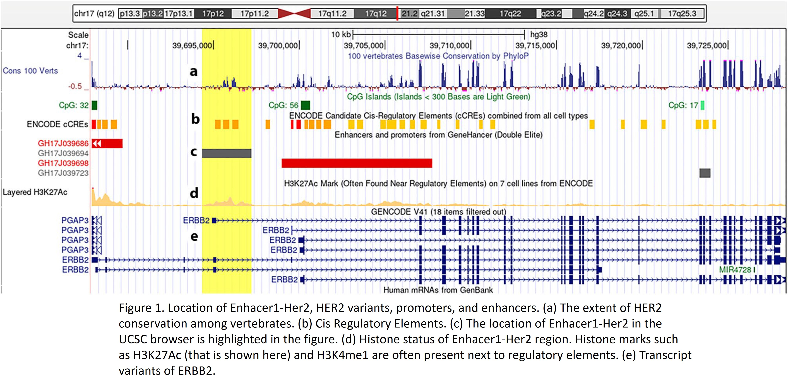

# HER2 Enhancer Functional Analysis in Breast Cancer

## Overview

This repository presents a comprehensive functional genomics study investigating **Her2-Enhancer1 (GH17J039694)** , a putative regulatory enhancer element located within the **ERBB2 (HER2)** gene locus in breast cancer.

Using **CRISPR/Cas9-mediated enhancer disruption**, this study evaluates the impact of enhancer activity on:
- HER2 variant expression
- Tumor suppressor pathways (GAS5, PTEN, P53)
- Stemness-associated transcription factors (NANOG, SOX2, OCT4)
- PI3K/AKT signaling pathway
- Cellular apoptosis and proliferation

> This project represents original research published in peer-reviewed journals, demonstrating expertise in cancer genomics, functional genomics, and CRISPR-based gene editing.

---

## Publication

This work has been published in:

| Publication | Journal | Year |
|-------------|---------|------|
| Functional analysis of a putative HER2-associated expressed enhancer, Her2-Enhancer1, in breast cancer cells | **Scientific Reports** (Nature) | 2023 |
| Gene Editing for Unraveling the Regulatory Role of a HER2-Associated Enhancer with lncRNA GAS5 and Related Genes | **J Adv Immunopharmacol** | 2024 |
| Functional and Bioinformatic Investigation of HER2-Associated Enhancer GH17J039694 | **Sarem Journal of Medical Research** | 2022 |

---

## Scientific Background

HER2 (ERBB2) is a major oncogene involved in breast cancer initiation, progression, and therapeutic response. While HER2 amplification and overexpression have been extensively studied, the contribution of **distal regulatory elements such as enhancers** remains incompletely understood.

Enhancer regions can modulate gene expression through chromatin interactions and transcription factor recruitment, influencing cancer-associated pathways independently of coding-sequence alterations.

This study focuses on **Her2-Enhancer1 (GH17J039694)** , an expressed enhancer located within the ERBB2 locus at chr17:39,694,339-39,697,219 (UCSC-hg38).

---

## Figures

### Genomic Context of HER2 Enhancer1

*UCSC Genome Browser visualization showing evolutionary conservation, cis-regulatory elements, CpG islands, histone marks (H3K27Ac), and ERBB2 transcript variants. The highlighted region corresponds to Her2-Enhancer1.*

### Cis and Trans Regulatory Effects

*Analysis of HER2 variants, interacting genes (GRB7, PGAP3), and cell cycle/apoptosis markers across SKBR3, MCF7, and HEK293 cell lines.*

### Western Blot Validation

*Protein expression changes in HER2, GRB7, and p-AKT following enhancer disruption in SKBR3 and MCF7 cell lines.*

## Research Objectives

| Objective | Description |
|-----------|-------------|
| 1 | Characterize the regulatory role of Her2-Enhancer1 |
| 2 | Evaluate HER2 expression changes following enhancer knockout |
| 3 | Investigate downstream effects on tumor suppressor pathways (GAS5, PTEN, P53) |
| 4 | Examine alterations in stemness-associated transcription factors |
| 5 | Assess therapeutic implications of enhancer targeting |

